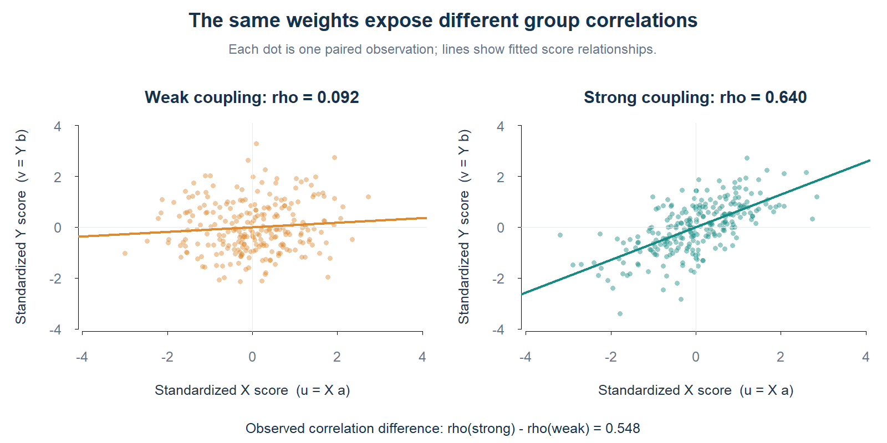

# dCCA

Differential canonical correlation analysis finds common X and Y feature
weights that maximize a weighted sum of Fisher-transformed correlations across
sample groups by default, with raw-correlation fitting available as an option.
It supports paired raw data, supplied covariances, shared or group-specific
marginal covariances, sparse weights, multiple starts, and multiple components.

## Environment and version requirements

The package has been tested with **R 4.4.1 on Windows 11 (64-bit)**. Use this
R version to reproduce the recorded environment. `DESCRIPTION` currently
declares no minimum R version or minimum versions for the runtime dependencies;
compatibility with older versions and other operating systems has not been
verified.

| Runtime dependency | Version tested and recorded in `renv.lock` |
| --- | --- |
| R | 4.4.1 |
| dplyr | 1.1.4 |
| expm | 1.0-0 |
| purrr | 1.0.4 |
| stats | Included with R |

These are tested versions, rather than declared minimum requirements. 

## Install and quick start

Install from GitHub:

```r
install.packages("remotes")
remotes::install_github("Rainali475/dCCA")
```

After installation:

```r
library(dCCA)
set.seed(1)
X <- list(control = matrix(rnorm(300), 100, 3),
          treated = matrix(rnorm(300), 100, 3))
Y <- lapply(X, function(x) x + matrix(rnorm(300), 100, 3))
fit <- dCCA(X = X, Y = Y, z = c(-1, 1))
fit$result$a
fit$result$b
fit$result$rho
fit$result$obj_val
```


## Dense-data demo

This simulated example uses 250 paired observations per group and four
features per view, with no sparsity constraints. Shared fitted weights reveal
weak and strong group correlations of approximately **0.092** and **0.640**.



See the [dense-data vignette](vignettes/dense-data.Rmd) for the simulation,
complete code, canonical weights, and Fisher objective calculations. When
installed with vignettes, open it using `vignette("dense-data", package = "dCCA")`.

## Input formats and preprocessing

**Paired lists:** each list element represents a sample group. Each X/Y pair
must have equal row counts, with the same observations in the same row order.
Groups may have different row counts, but feature counts and column ordering
must agree across groups within each view. X and Y may have different feature
counts. List names, if supplied, must match in order. `z` follows list order;
omit `samps` for this format.

**Matrices or numeric data frames:** rows are observations and columns are
features. X and Y must have equal row counts. Use `samps` to label each row:

```r
fit_matrix <- dCCA(
  X = do.call(rbind, X), Y = do.call(rbind, Y),
  samps = rep(c("control", "treated"), each = 100), z = c(-1, 1)
)
```

Factor labels use their retained level order; other labels use first appearance.
Unused factor levels are dropped. Without `samps`, matrix data form one group.
Each group needs at least two observations. All data must be numeric and finite;
missing values are not imputed. Raw observations are centered within groups
without scaling features. Group covariances use denominator `n_group - 1`.

**Precomputed covariances:** supply `var.xy` instead of raw data. For p X features,
q Y features, and G groups, its shape is p-by-q-by-G; a p-by-q matrix represents
one group. `var.x` and `var.y` accept p-by-p and q-by-q shared matrices or
p-by-p-by-G and q-by-q-by-G arrays. Omitted marginal covariances default to
identity in covariance-only mode:

```r
fit_cov <- dCCA(
  var.xy = diag(c(0.8, 0.3)), var.x = diag(2), var.y = diag(2),
  equal_var.x = TRUE, equal_var.y = TRUE, ncc = 2,
  fisher.transform = FALSE
)
```

With raw data, supplied covariances override their empirical counterparts.
Ensure dimensions and group order match. Marginal covariances must be symmetric
positive definite. Remove redundant features or supply regularized covariances
for high dimensional or collinear data. Cross-covariances should be consistent
with the supplied marginals; Fisher clipping does not validate that consistency.

## Objective and Fisher transformation

By default, the objective is `sum(z * atanh(rho))`, where `rho` contains one
correlation per group. Set `fisher.transform = FALSE` to maximize the raw
correlation objective `sum(z * rho)` instead. `z = NULL` uses weights of one. Otherwise supply one finite numeric
weight per group. Nonconstant weights are centered and divided by their sample
standard deviation; constant nonzero weights remain unchanged. All-zero weights
are rejected. Thus the magnitude of a nonconstant input z is not preserved.
Positive weights favor positive correlations; negative weights favor negative
correlations. Every group contributes once, regardless of its observation count.

```r
fit_fisher <- dCCA(
  X = X, Y = Y, z = c(-1, 1), fisher.transform = TRUE
)
```

`fisher.transform = TRUE` maximizes `sum(z * atanh(rho))`. This emphasizes
correlation differences near -1 and 1 more strongly. Before transformation,
correlations are clipped to `+/- (1 - sqrt(.Machine$double.eps))` to avoid
infinite objectives. The analytic gradient applies the Fisher chain rule inside
these bounds and is zero in the clipped regions. This transforms the fitting
objective; it does not compute a Fisher significance test, confidence interval,
or sample-size correction.

Fisher fits always use iterative optimization, including with shared covariance
flags. Returned `rho` and covariance deflation retain the raw correlation scale;
`obj_val` and its history use the selected objective. The default is `TRUE`;
set `fisher.transform = FALSE` to use the original fitting path.

## All dCCA options

| Argument | Default | Meaning |
| --- | --- | --- |
| `X`, `Y` | `NULL` | Paired lists, matrices, or numeric data frames; supply both together. |
| `samps` | `NULL` | Row group labels for matrix inputs; omit for lists. |
| `z` | `NULL` | Equal group weights by default; otherwise one weight per group, standardized when nonconstant. |
| `var.xy` | `NULL` | Supplied cross-covariance matrix or array; otherwise estimated from raw data. |
| `var.x`, `var.y` | `NULL` | Supplied marginal matrices or arrays; empirical with raw data, identity without raw data. |
| `equal_var.x`, `equal_var.y` | `FALSE` | Use a shared marginal covariance in that view. Raw-data estimates pool centered cross-products using denominator total rows minus group count. Supplied arrays must contain identical slices. |
| `c1`, `c2` | `NULL` | L1 bounds on unit L2 X/Y weights. Finite bounds must be at least 1; NULL disables sparsity. Bounds at or above sqrt(feature count) are inactive. |
| `a_inits`, `b_inits` | `NULL` | Paired lists of finite, nonzero starting vectors of length p and q. Defaults are all-ones vectors; if only one list is supplied, default vectors are repeated to match it. |
| `L2_sol_init` | `FALSE` | For sparse fits, solve the unconstrained problem across starts first, then initialize the sparse fit with its best weights. Retains the chosen raw or Fisher objective. |
| `epsilon` | `1e-6` | Outer convergence tolerance: absolute objective change must be at most epsilon times (absolute previous objective plus epsilon). |
| `patience` | `10` | Stop after more than this many consecutive iterations below the best objective. |
| `max_iter` | `1000` | Positive integer cap on outer iterations per fit and component; NULL also means 1000. Initialization and each start have separate caps. |
| `solver` | `"CG"` | Nested optimizer: conjugate gradients with analytic derivatives, or `"Nelder-Mead"` without derivatives. |
| `solver_eps` | `1e-6` | Positive absolute and relative tolerance for the nested optimizer. |
| `ncc` | `1` | Integer component count from 1 to min(p, q). |
| `fisher.transform` | `TRUE` | Use the clipped Fisher-transformed objective when TRUE. |

Sparse example with multiple starts:

```r
set.seed(2)
fit_sparse <- dCCA(
  X = X, Y = Y, z = c(-1, 1), c1 = 1.3, c2 = 1.3,
  a_inits = list(rep(1, 3), rnorm(3)),
  b_inits = list(rep(1, 3), rnorm(3)),
  L2_sol_init = TRUE, fisher.transform = TRUE,
  max_iter = 100, ncc = 2
)
```

Soft thresholding and alternating optimization are heuristic local methods.
Multiple starts can reach different solutions. The best objective across starts
and iterates is retained; sparse updates can reduce the objective. When both
marginal covariances are shared, sparsity is disabled, and Fisher mode is off,
a whitened SVD gives the closed-form fit. Otherwise weights are updated in
alternation, using shared-covariance closed-form updates where applicable.

Additional iterative components are extracted by sequentially deflating the
cross-covariances while keeping marginal covariances fixed. Their correlations
refer to the deflated covariances; weights need not be orthogonal across groups.
Weight pairs have an arbitrary simultaneous sign, so compare paired scores or
correlations rather than interpreting a sign in isolation.

## Return values and diagnostics

The return value has `result` and `parameters`. For one iterative component,
`result` contains:

- `a`, `b`: unit L2 feature-weight vectors from the best iterate.
- `rho`: raw correlations for each group, in input group order.
- `obj_val`: the selected raw or Fisher objective at those weights.
- `n_iter`: total completed outer iterations, not the best-iterate index.
- `convergence`: whether the objective-change criterion was met. Reaching
  patience or the iteration cap alone does not mark convergence.
- `a_record`, `b_record`: initialization and subsequent weight histories.
- `obj_val_record`: initialization and all subsequent objective values.

The full histories can end at weights different from the returned best weights.
For multiple iterative components, `result` is a list of these component results.
Closed-form fits instead return matrices `a` and `b` with components in columns,
a group-by-component `rho` matrix, and a vector `obj_val` of weighted-objective
singular values; iterative histories are absent. The closed-form path uses the
original cross-covariances for all returned correlations.

`parameters` records covariance inputs used, processed weights z, variance flags,
sparsity bounds, and the Fisher flag. It records a method description and, where
applicable, outer and nested solver tolerances. Use `?dCCA` for package help.


## License

MIT license. Copyright (c) 2026 Yuzi Li. See [LICENSE.md](LICENSE.md).
